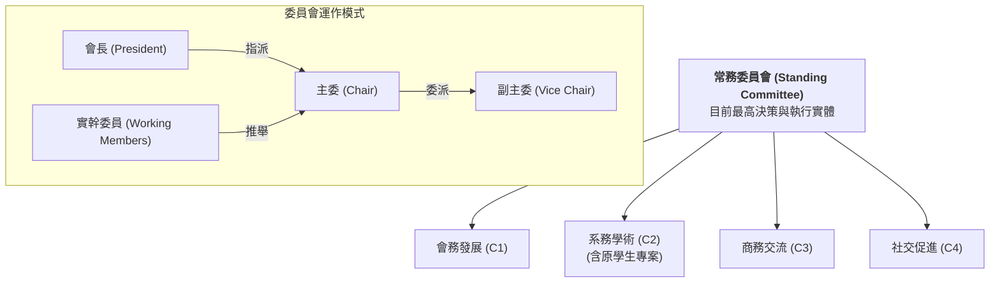

# 🏛️ 機械系系友會：組織架構與委員會職能

為了落實「薪火相傳、價值對位」的願景，系友會將建立四大專業委員會，作為推動會務的核心引擎。每個委員會由「志願委員」組成，其「主委 (Chairperson)」可由會長指派或由委員推舉產生，再由主委委派「副主委 (Vice Chairperson)」。

---

## 🏗️ 組織架構圖 (現階段過渡架構)

> **備註**：根據常委會第三次會議決議，為整合產學資源並加速對接，原「學生事務專案委員會 (C4)」正式併入「系務學術委員會 (C2)」。原「社交促進委員會 (C5)」之代號順移為 `C4`。目前「祕書處」之功能暫由常務委員會兼任。

---

## 📂 四大委員會職能詳述

### **1. 會務發展委員會 (C1)**
*   **核心目標**：確保系友會的長期可持續性與資源基礎。
*   **關鍵任務**：
    *   推動系友會法人化 (A19 專案)。
    *   負責大型募資策略與年度大水庫基金規劃。
    *   規劃行政管理流程與數位轉型路徑。

### **2. 系務學術委員會 (C2)**
*   **核心目標**：強化系友與母系研發能量的對接，並精準賦能學弟妹，加速人才梯隊建設。
*   **關鍵任務**：
    *   將系上尖端技術資源 (Layer 1) 轉化為系友可理解的解決方案。
    *   推動「標籤圖譜」中的科研資源與產學專門技術對位。
    *   協助系友尋找母系產學合作、專利技轉之對接點（如 A04 產學接力小聚、A21 產業命題懸賞計畫）。
    *   **學生專案輔導**：直接對接學生競賽專案（賽車/火箭/機器人/Gokart），提供專案管理經驗與實作引導。
    *   **導師與獎學金**：推動 Mentorship 導師計畫與獎助學金的目標型投放。

### **3. 商務交流委員會 (C3)**
*   **核心目標**：建立「由內而外」的商務信任網路與實戰對流。
*   **關鍵任務**：
    *   促進跨世代系友企業間的供應鏈媒合與技術服務對接。
    *   舉辦「系友企業參訪」與「商務媒合專場」。
    *   負責維護資源引擎中的 S-02 (產業通路) 與 D-12 (供應鏈) 標籤。

### **4. 社交促進委員會 (C4)**
*   **核心目標**：厚化社群信用 (Social Credit) 與情感連結。
*   **關鍵任務**：
    *   建立各級別、各區域系友聯絡網。
    *   籌辦年會、系慶（如畢業 10/20/30 年回娘家與輪值師門活動）等大型團聚。
    *   經營數位社群與官網內容，提升系友會的在場感與認同感。

---

## 🚀 下一步行動
*   [ ] **種子委員邀約**：針對已知核心系友進行定向邀約。
*   [ ] **選拔流程基準化**：定義委員會互選主委的細則。
