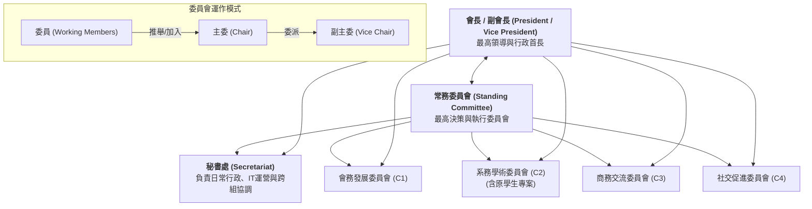

為了落實「薪火相傳、價值對位」的願景，系友會將建立四大專業委員會，作為推動會務的核心引擎。每個委員會由「志願委員」組成，其「主委 (Chairperson)」可由會長指派或由委員推舉產生，再由主委委派「副主委 (Vice Chairperson)」。

---

## 🏗️ 組織架構圖 (現階段過渡架構)

> **備註**：根據常委會第三次會議決議，為整合產學資源並加速對接，原「學生事務專案委員會 (C4)」正式併入「系務學術委員會 (C2)」。原「社交促進委員會 (C5)」之代號順移為 `C4`。目前「祕書處」之功能暫由常務委員會兼任。

---

## 👥 核心會務與委員會人員清單 (Leadership List)

| 職稱 | 姓名 | 級別/系級 | 權責範疇 |
| :--- | :--- | :--- | :--- |
| **會長** | 李志強 | 79 級 | 總體會務決策與領導 |
| **副會長** | 黃建平 | 83 級 | 協助會長決策及分管會務推動 |
| **常務委員會** | 全體常委 | - | 資源媒合決策、預算核定與執行監督 |
| **秘書長 (秘書處主管)** | 許武龍 | 84 級 | 統籌秘書處日常行政與 IT 自動化運營維護 |
| **會務發展 (C1) 主委** | 歐耿良 | 91 博 | 負責 C1 會務發展（組織法人化與財務規劃） |
| **系務學術 (C2) 主委** | 鄭銘洲 | 79 級 | 負責 C2 整合產學對位與學生專案輔導 |
| **系務學術 (C2) 副主委** | 錢懷清 | 86 級 | 協助 C2 整合產學對位與學生專案輔導 |
| **商務交流 (C3) 主委** | 洪鏈翔 | 91 研 | 負責 C3 商務交流與供應鏈對接 |
| **社交促進 (C4) 主委** | 葉彰和 | 73 級 | 負責 C4 社交促進、海外校友與聯絡網營運 |

---

## 📂 秘書處與四大委員會職能詳述

> [!TIP]
> 關於各活動代號（A01 ~ A25）的具體價值核心、雙贏機制與詳細設計，請參閱 [**資源對接網絡框架**](../../network/framework/)。

### **🏛️ 秘書處 (Secretariat)**
*   **核心目標**：統籌系友會日常行政、會議記錄、IT 系統維護、數據同步與跨委員會協調，確保組織基建穩定運轉。
*   **關鍵任務**：
    *   **網站的建構與維護 (A26)**：負責官方網站架置、內容更新、代碼發布與前端維修。
    *   **資料庫運營與自動化 (A27)**：維護 Google Sheets 問卷自動同步腳本、SQLite 資料庫與編譯跳過等自動化機制之運行。
    *   **資料核實與修正**：執行代理聯繫表單與資料修正日誌 (`data_fix_log.md`) 的審核工作。
    *   **常委會協調**：籌備常務委員會議、記錄決議，並作為各大委員會的行政聯絡窗口。
*   **對應活動代號清單**：
    *   `A06` 行政自動化
    *   `A26` 網站的建構與維護
    *   `A27` 資料庫運營與推動自動化運行

### **1. 會務發展委員會 (C1)**
*   **核心目標**：確保系友會的長期可持續性與資源基礎。
*   **關鍵任務**：
    *   推動系友會法人化 (A19 專案)。
    *   負責大型募資策略與年度大水庫基金規劃。
    *   規劃行政管理流程與數位轉型路徑。
    *   籌辦年會、系慶（如畢業 10/20/30 年回娘家與輪值師門活動）等大型團聚。
    *   規劃與設計官網功能。
    *   組建系友資源媒合的核心架構，推動系友-系上各種資源媒合。    
*   **對應活動代號清單**：
    *   `A06` 資源問卷資料庫 (系慶啟動問卷)
    *   `A18` 個人信譽與貢獻追蹤 (系慶資源牆)
    *   `A19` 組織法人化推動小組

### **2. 系務學術委員會 (C2)**
*   **核心目標**：強化系友與母系研發能量的對接，並精準賦能學弟妹，加速人才梯隊建設。
*   **關鍵任務**：
    *   將系上尖端技術資源 (Layer 1) 轉化為系友可理解的解決方案。
    *   推動「標籤圖譜」中的科研資源與產學專門技術對位。
    *   協助系友尋找母系產學合作、專利技轉之對接點（如 A04 產學接力小聚、A21 產業命題懸賞計畫）。
    *   **學生專案輔導**：直接對接學生競賽專案（賽車/火箭/機器人/Gokart），提供專案管理經驗與實作引導。
    *   **導師與獎學金**：推動 Mentorship 導師計畫與獎助學金的目標型投放。
*   **對應活動代號清單**：
    *   `A02` PM 顧問計畫
    *   `A04` 產學接力小聚
    *   `A07` G0 連結接地氣群 (連結群)
    *   `A08` 技術 PoC 驗證場 (技術 Beta 測試)
    *   `A12` 學生需求動態回饋
    *   `A13` 企業與工廠參訪
    *   `A14` 亮點業師入班演講
    *   `A20` 獎助學金精準媒合
    *   `A21` 產業命題懸賞計畫 (產學對接)
    *   `A22` 工業級加工實務指導 (實作團隊對接)
    *   `A23` 職涯預判與履歷診斷

### **3. 商務交流委員會 (C3)**
*   **核心目標**：建立「由內而外」的商務信任網路與實戰對流。
*   **關鍵任務**：
    *   促進跨世代系友企業間的供應鏈媒合與技術服務對接。
    *   舉辦「系友企業參訪」與「商務媒合專場」。
    *   負責維護資源引擎中的 S-02 (產業通路) 與 D-12 (供應鏈) 標籤。
*   **對應活動代號清單**：
    *   `A01` 大師智慧訪談 (系友訪談)
    *   `A03` 職涯閃電諮詢 (FM)
    *   `A05` 線上徵才專區 (聯合人才推介)
    *   `A10` 家族傳承小聚 (二代接班小聚)
    *   `A15` 系友供應鏈對稱小聚
    *   `A16` 創業投資與天使導標
    *   `A17` 職涯策略深度座談

### **4. 社交促進委員會 (C4)**
*   **核心目標**：厚化社群信用 (Social Credit) 與情感連結。
*   **關鍵任務**：
    *   各式社團活動、如高爾夫球社。
    *   建立各級別群組、各區域系友聯絡網，組織相關活動。
    *   經營數位社群與官網內容，提升系友會的在場感與認同感。
*   **對應活動代號清單**：
    *   `A09` 全球落地支援網 (全球落地支援)
    *   `A11` 系慶與小聚營運 (系慶營運)
    *   `A24` 級別連絡人網絡營運
    *   `A25` 跨業興趣與社交分群

---

## 🚀 下一步行動
*   [ ] **種子委員邀約**：針對已知核心系友進行定向邀約。
*   [ ] **選拔流程基準化**：定義委員會互選主委的細則。
