# 🎓 [機制草案] 畢業 10/20/30 年系友回娘家與師門機制設計方案

> **⚠️ 注意**：本文件為內部討論機制草案，僅供常委會與核心小組成員討論與評估使用。

- **版本**: V0.1

本文件定義交大機械系於校慶期間舉辦「畢業 10, 20, 30 年系友回娘家」與「師門（實驗室）機制」整合之活動設計與執行架構。

---

## 📌 一、 活動設計背景與目的

### 1. 情感與文化面（向內凝聚）
* **對指導教授的感恩與尊榮**：讓辛苦一輩子的老教授看見自己「桃李滿天下」，在晚宴上接受上百位各界精英學生的掌聲，這是對為師者最高的榮譽。
* **重溫青春與身份認同**：讓步入中年（畢業 20、30 年，約 40-50 歲）正處於高壓接班或管理階層的學長姐，回到相對單純的校園與實驗室，找回當初做研究、熬夜的熱情與「交大機械人」的驕傲。

### 2. 資源與發展面（向外延伸）
* **為母系募款與爭取資源**：學校資源有限，系上的大樓翻新、實驗室設備更新、學弟妹的專題競賽獎學金，很大一部分仰賴 20、30 年這群正值事業巔峰、掌握企業資源的校友實質捐款。
* **產學合作與技術對接**：30 年的學長可能已經是科技廠總經理，10 年的學弟可能正在帶領研發團隊。透過師門茶會，學長可以把業界當前的「實務痛點」帶回實驗室，直接與現任教授開啟科技部產學合作案。

### 3. 世代傳承（最核心的目的）
* **學弟妹的職涯明燈**：在學的碩博士生在面對未來就業、選填志願（如半導體、智慧製造、新創）時往往很迷茫。回娘家活動讓他們能「直接端茶給各科技廠的主管學長」，學長的一句提點、甚至一張名片，就是最直接的企業實習與就業引路。

---

## 🏛️ 二、 畢業 10, 20, 30 年系友回娘家機制

核心策略：「以人找人，化整為零」，解決系友會聯絡名單失效之痛點。

### 1. 級召集人制度
* **系友會核心協調人**：負責訂定當年度校慶的時程表、包桌場地預扣、主視覺設計與報名系統建立。
* **級召集人（當級活動聯絡人）**：於校慶前 **半年前（約前一年 10-11 月）**，由協調人透過當年畢業紀念冊、班代、留校任教或企業活躍校友尋得。
* **主要任務**：級召集人負責回頭建立該屆（例如畢業 10 年、20 年、30 年級）的 Line 群組/FB 社團，將失聯同學重新拉回。

### 2. 包桌與統計人數流程
* **預估與包桌**：協調人先根據歷史經驗，預估 30 年（出席率最高、凝聚力最強、經濟能力最好）、20 年、10 年的基本桌數，向校友會預訂桌次。
* **報名與公告**：由系友會提供統一的線上報名表單。各級召集人在各自同學群組內催人，並透過系友會網站、班級聯絡人群、系上公告宣傳。
* **桌次安排**：按「級」分區（10/20/30年），每級內部再依當年的「班別（AB班）」排桌。

### 3. 經費與贊助機制
* **系友會發展基金/系方自籌**：補助活動基本行政、場地、及邀請退休老教授餐費。
* **使用者付費與認購**：
  * **10 年系友**（事業衝刺期）：採取免餐費（由學長贊助）或象徵性收取基本費。
  * **20/30 年系友**：收取標準餐費，或鼓勵以「認購一桌」方式回饋。
* **大老/傑出系友贊助**：
  * **學長包桌贊助**：由 30 年或更資深之傑出系友/企業主，直接認購 3-5 桌，指定「贊助給 10 年學弟妹免費就座」，象徵傳承。
  * **紀念品贊助**：聯絡當級系友企業，贊助報名禮（特製保溫杯、紀念 T-shirt、新竹在地伴手禮）。

---

## 🧪 三、 「師門（實驗室）」機制的配套設計

機械系對實驗室/指導教授的黏著度往往大於班級，引入師門配套能加深情感連結。

### 1. 師門輪值原則
目前交大機械共 31 個師門，分為三組：
1. **設計製造組** (11 個師門)
2. **熱流組** (8 個師門)
3. **固力與控制組** (12 個師門)

* **輪值規則**：每年三組各找一個師門擴大舉辦為原則。若遇到師門太小，可以兩個師門合併舉辦。

### 2. 師門大小活動做法
採取「下午分流、晚上合流」雙軌制：
* **下午（師門時間 - 前分）**：該年輪值師門由現有實驗室學弟妹協助，於系館會議室或實驗室舉辦「師門回娘家茶會」。師兄弟齊聚一堂向老師匯報近況。
* **晚上（全體大會 - 後合）**：所有人移師大會場辦桌。晚宴上系友會特別安排「師門感恩致敬」橋段，請輪值師門的靈魂教授上台接受致敬，台下該師門桌次集體歡呼。

### 3. 執行痛點與解法
* **痛點**：中生代或新進教授平時教學研究極忙，無暇聯絡畢業已久之系友。
* **解法**：
  1. **系友會行政協助**：系友會協調人於半年前通知輪值教授，告知系友會將全力協助行政與場地。
  2. **抓出「大師兄」**：請教授或現任助理提供實驗室畢業校友中較熱心、與老師保持聯絡的「大師兄/大學姐」，由其擔任該師門的「師門召集人」。

---

## 👥 四、 核心角色活動執掌

為了讓活動高效運轉，建立金字塔型互助網絡：

| 角色 | 定位 | 核心執掌 |
| :--- | :--- | :--- |
| **系友會總協調人** (秘書長) | 活動大腦與資源後盾 | - 訂定總體時程、租借校內場地、發文通知 - 建置報名與金流系統 - 聯繫退休老教授與系上師長 - 統籌晚宴外包與紀念品製作 |
| **當級活動聯絡人** (10/20/30年級召集人) | 橫向（同屆）號召力核心 | - 尋找AB班班代與活躍份子，建立核心籌備群 - 在同學群組進行滾雪球式催報名 - 爭取當屆同窗企業之桌次認購或物資贊助 |
| **師門大師兄** (輪值師門召集人) | 縱向（跨屆實驗室）情感黏著劑 | - 與現任實驗室助理/學弟妹對接，取得歷屆名單 - 規劃下午「師門茶會」流程與感恩禮物 - 統計並掌控晚宴師門包桌數，帶動現場氣氛 |
| **學生工作隊** (系學會/在學學弟妹) | 現場執行與活力來源 | - 現場引導、簽到接待、紀念品發放 - 協助學長姐拍照留念 - 於下午茶會向學長姐簡報實驗室最新研究成果 |

---

## 📅 五、 執行時程建議表（半年前啟動）

為預留「尋人建群」、「海外行程排定」、「大額贊助審查」與「熱門場地卡位」之時間，必須於半年前啟動：

```mermaid
gantt
    title 系友回娘家籌備甘特圖 (半年前啟動)
    dateFormat  X
    axisFormat %d
    section 籌備階段
    確定名單與輪值師門 (前6月)     :active, p1, 0, 30
    尋找級召集人與大師兄 (前5月)   :p2, 30, 60
    建立Line群組與報名系統上線 (前3月) :p3, 90, 120
    第一波統計與贊助洽談 (前2月)   :p4, 120, 150
    精準訂桌與座位編排 (前1月)     :p5, 150, 180
    校慶當日執行                 :milestone, p6, 180, 180
```

*   **校慶前 6 個月**：確定 10, 20, 30 年的畢業級數與名單，敲定當年度主打的 **3 個輪值師門**。*(主辦：系友會協調人、系主任)*
*   **校慶前 5 個月**：找到各級的「級召集人」與各師門的「大師兄」，召開第一次線上籌備會。*(主辦：系友會協調人、各級召集人)*
*   **校慶前 3 個月**：各級與各師門 Line 群組建立完畢開始串聯，線上報名系統上線。*(主辦：各級召集人、大師兄)*
*   **校慶前 2 個月**：第一波人數統計，開始洽談傑出系友包桌贊助與紀念品，確認退休老教授出席意願。*(主辦：系友會理事長、協調人)*
*   **校慶前 1 個月**：封閉式人數清查，精準訂桌與排座位表（按年級、班級、師門交錯），確定活動流程。*(主辦：系友會協調人)*
*   **校慶當日**：下午：各實驗室師門茶會 ➔ 晚上：全體系友辦桌晚宴。*(主辦：全體參與者)*
